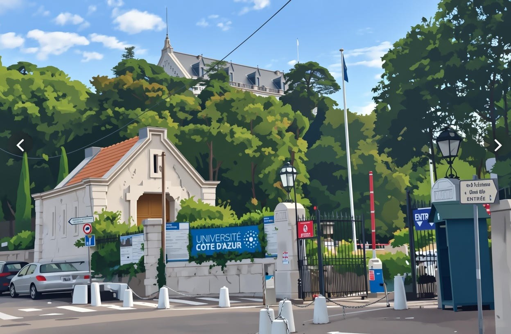
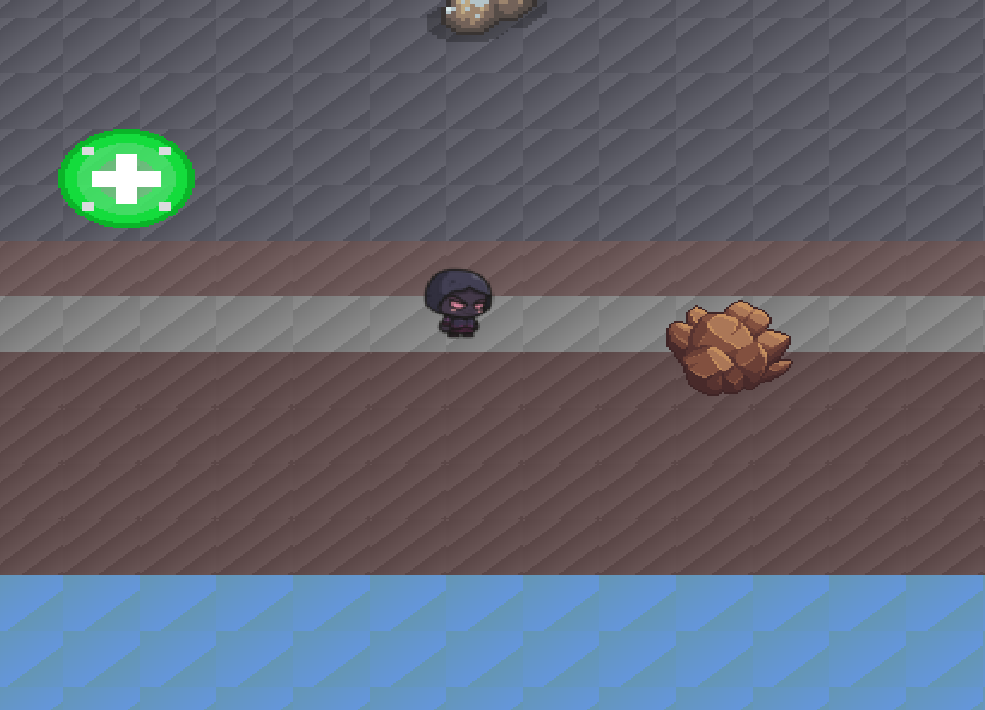

<!--  -->

# Adventure Quest JAVA

Moteur de jeu 2D extensible avec LibGDX.

## Sommaire
- [Présentation](#présentation)
- [Architecture (MVC)](#architecture-mvc)
- [Fonctionnement](#fonctionnement)
- [Contrôles](#contrôles)
- [Gestion de la santé](#gestion-de-la-santé)
- [Technologies](#technologies)
- [Compilation et exécution](#compilation-et-exécution)
- [Extensibilité](#extensibilité)
- [Limites](#limites)

## Présentation

Adventure Quest est un jeu 2D top-down reposant sur un moteur de jeu générique développé avec LibGDX.
Le moteur est conçu pour permettre l’enrichissement du contenu du jeu uniquement via l’éditeur de cartes Tiled, sans modification du code Java.

Le moteur prend en charge :
- le chargement dynamique de cartes `.tmx`
- la création automatique des entités à partir des données Tiled
- la gestion des collisions, des dégâts et des portails
- la logique de déplacement et d’interaction du joueur

## Architecture (MVC)

Le projet adopte une architecture MVC (Modèle / Vue / Contrôleur) afin de garantir la lisibilité, la maintenabilité et l’extensibilité du code.

### Modèle

Contient les données et la logique métier :
- Player : position, points de vie, déplacements
- NPC : entités statiques avec dialogues
- Obstacle :
	- solide (bloquant)
	- dangereux (inflige des dégâts)
- Portal : lien entre deux cartes
- GameMap : représentation logique d’une carte Tiled

### Contrôleur

Contient la logique de jeu et les systèmes globaux :
- GameController : boucle principale et orchestration
- InputHandler : gestion des entrées clavier
- CollisionManager :
	- collisions joueur ↔ mur
	- collisions joueur ↔ obstacles
- PortalManager : téléportation entre cartes
- SaveLoadManager : sauvegarde / restauration de l’état du jeu

### Vue

Gère l’affichage :
- Renderer : rendu des entités
- MapRenderer : affichage de la carte Tiled
- Caméra centrée sur le joueur avec limites de carte

## Fonctionnement


### Chargement des cartes

Les cartes sont créées dans Tiled et chargées au runtime via LibGDX.

Chaque carte contient :
- une couche `background` (décor)
- une couche `collision` (tiles bloquantes)
- une couche `entities` (joueur, PNJ, obstacles)
- une couche `portals` (passages entre cartes)

Le moteur interprète automatiquement les couches et leurs propriétés pour instancier les entités correspondantes.

### Système d’entités (via Tiled)

Les entités sont définies uniquement par les propriétés Tiled.

**Player**
- défini par : `type=PLAYER`
- la position initiale sert de point de respawn
- points de vie : 100 PV

**PNJ**
- `type=NPC`
- propriétés : `name`, `dialogue`

**Obstacles**
- `type=OBSTACLE`
- propriété : `obstacleType`
- solide : bloque le déplacement
- dangereux (spike, lava, fire, danger) : inflige des dégâts

**Portails**
- couche `portals`
- propriétés : `targetMap`, `targetX`, `targetY`

Aucune modification du code n’est nécessaire pour ajouter de nouvelles entités tant que leur type est reconnu par le moteur.

## Contrôles

### Déplacement
- vue top-down
- déplacement continu sur 4 directions
- collisions gérées par :
	- la couche `collision`
	- les obstacles solides

### Clavier
- déplacement : ZQSD ou flèches
- interaction PNJ : E ou F
- validation / menu : Entrée ou Espace

## Gestion de la santé

- points de vie maximum : 100 PV
- collision avec un obstacle dangereux :
	- −15 PV par contact
	- cooldown pour éviter la perte continue
- lorsque les PV atteignent 0 :
	- le joueur est téléporté à son point de spawn
	- les PV sont réinitialisés

## Technologies

### Technologies utilisées
- Java (JDK 11+)
- LibGDX (framework principal)
- LWJGL3 (backend bureau)
- Tiled (éditeur de cartes)

### Dépendances principales (Gradle)
- `com.badlogicgames.gdx:gdx`
- `gdx-backend-lwjgl3`
- `gdx-platform`
- `gdx-box2d` (si utilisé)

Gestion automatique via Gradle.

## Compilation et exécution

### Prérequis
- Java 11 ou supérieur
- Gradle Wrapper inclus dans le projet

### Compilation
```bash
./gradlew build -x test --no-daemon
```

### Lancement du jeu
Si la tâche `desktop:run` est disponible :
```bash
./gradlew desktop:run
```

Sinon (selon configuration du projet) :
```bash
./gradlew run --no-daemon
```

Le moteur charge automatiquement la carte initiale, instancie les entités définies dans Tiled et démarre la boucle de jeu.

## Extensibilité

Le moteur est conçu pour être étendu facilement :
- ajout de nouvelles cartes sans modifier le code
- configuration des entités via Tiled
- possibilité d’ajouter de nouveaux types d’entités par héritage
- logique de jeu centralisée et découplée de l’affichage

## Limites

- IA ennemie simple ou absente
- pas de système de combat avancé
- sauvegarde minimale de l’état

Ces limites sont assumées afin de privilégier la clarté de l’architecture et le respect des objectifs pédagogiques.


@github : sh0z3n